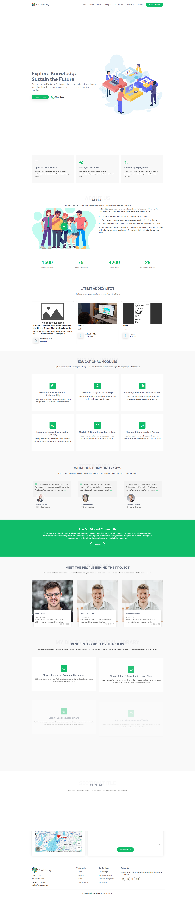
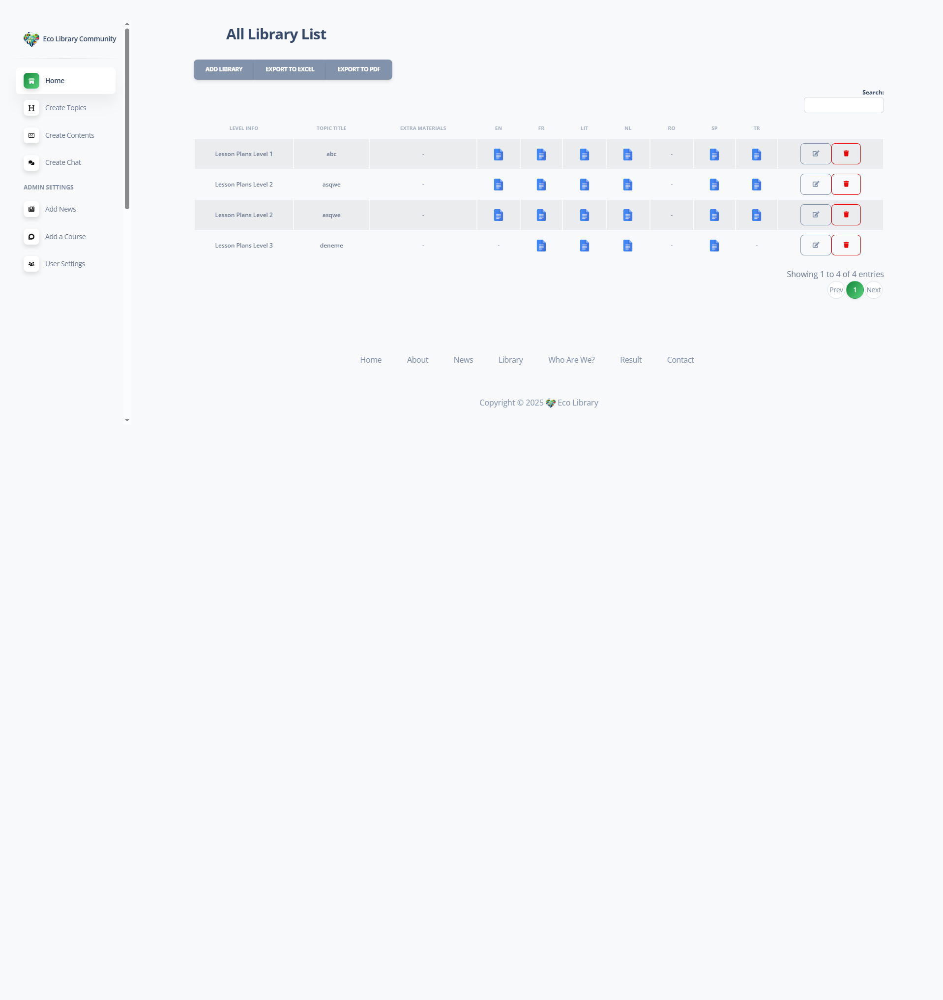
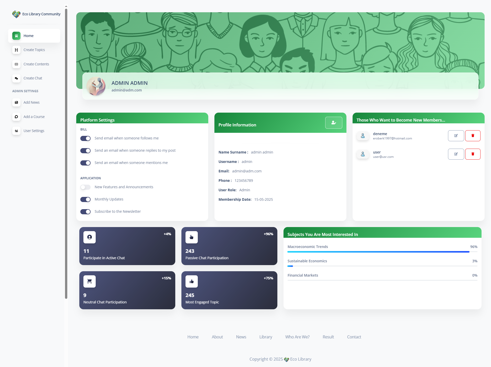

# 🌿 EcoLibrary

**EcoLibrary** is an open-source digital library platform designed to promote environmental literacy. Built with PHP and styled with a responsive dashboard UI, it allows users to explore, manage, and contribute eco-themed books and publications.

[![Dashboard Preview]](https://demos.creative-tim.com/soft-ui-dashboard/pages/dashboard.html?_ga=2.71143639.619034202.1750348108-595482544.1746633206)

---

## 🚀 Features

✅ **Responsive Dashboard Interface**  
✅ **Book Category Management**  
✅ **User-Friendly Navigation**  
✅ **Member Chat & File Sharing Area** 🗨️📎  
✅ **Admin-Only News Management Panel** 📰  
✅ **Modular PHP Architecture**  
✅ **SQL-ready database for instant deployment**

---

## 🧱️ Tech Stack

- 🐘 PHP (Backend)
- 🎨 HTML5 / CSS3 / JS
- 📆 Soft UI Dashboard by Creative Tim  
- 💃 MySQL (Database – [`ecolibrary.sql`](ecolibrary.sql))

---

## 🗄️ Screenshots

### 📚 Main Dashboard


### 📂 Book Category Listing


### 🧑‍💻 Admin Panel


> *Visuals are from the `index.php` and Soft UI dashboard interface*

---

## 🛠️ Installation

```bash
# Clone the repository
git clone https://github.com/yourusername/ecolibrary.git

# Import the SQL file to your MySQL server
phpMyAdmin or CLI > import `ecolibrary.sql`

# Place project in your local PHP server root (e.g. `localhost` or `XAMPP/htdocs`)
```

---

## 👥 Member Interaction

EcoLibrary is more than a book archive — it's a **community hub**. Registered users can:

- 🗨️ Chat with other members in real-time
- 📎 Share files, documents, or eco-resources
- 🧾 Leave feedback or suggestions

> 🛑 Access to chat and file sharing is restricted to registered users only.

---

## 🛡️ Admin Dashboard

Admins have full control over content and moderation:

- 📰 **Add / Edit / Delete News Articles**
- 🔍 **Oversee User Interactions**
- 🧾 **Manage Book Categories & System Settings**


---

## 🌍 Purpose

EcoLibrary is intended for educational communities, non-profits, and sustainability enthusiasts who want to create an open platform for sharing environmental knowledge.

---


## 🤝 Contribution

Feel free to fork, open issues, or send pull requests. Let’s grow this green library together! 🌱

---

> **Note:** The `lib/` directory contains essential assets (CSS, JS, and image files), but it is excluded from this repository due to its large file size. If needed, feel free to contact me, and I’ll be happy to share those resources with you.
